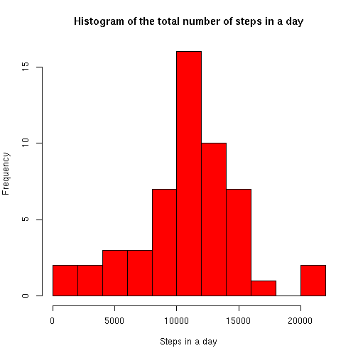
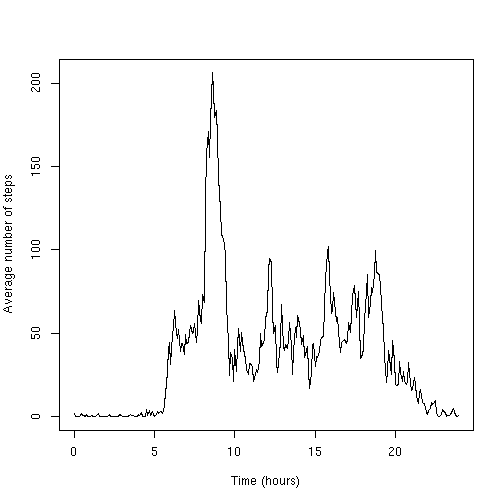
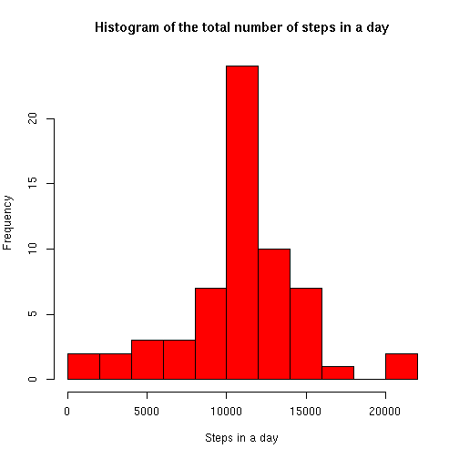
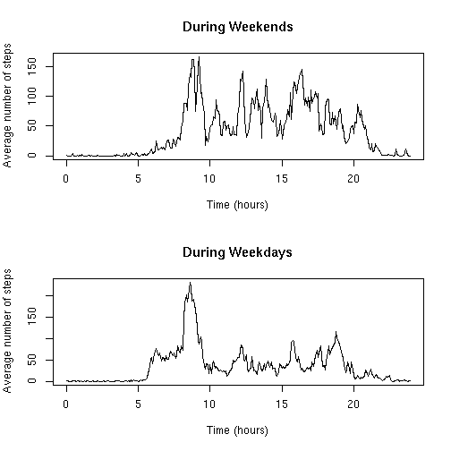

# Reproducible Research: Peer Assessment 1

In this study, data from a personal activity monitoring device is analysed. 


## Loading and preprocessing the data

In this step, the file containing the data is downloaded from the web site where it is located, unzipped and read. The obtained data.frame is called **datos**.


```r
download.file("http://d396qusza40orc.cloudfront.net/repdata%2Fdata%2Factivity.zip", 
"activity.zip")
unzip("activity.zip")
datos=read.csv("activity.csv",header=TRUE,sep=",",stringsAsFactors=FALSE)
```

Next, a proper **date** vector is obtained from the column **date** in the data.frame that contains dates coded as strings. A **time** vector containing time in hours is also created.


```r
date=strptime(datos$date,format="%Y-%m-%d")
time=(0:287)/12
```


## What is mean total number of steps taken per day?

A vector called **StepsPerDay** is calculated to contain the total number of steps per day. A histogram (Figure 1) is obtained from this vector and its mean and median values calculated.


```r
StepsPerDay=tapply(datos$steps,as.factor(datos$date),sum)
hist(StepsPerDay,main="Histogram of the total number of steps in a day",
xlab="Steps in a day",breaks=10,col="red")
```

 

```r
mean(StepsPerDay,na.rm=T)
```

```
## [1] 10766
```

```r
median(StepsPerDay,na.rm=T)
```

```
## [1] 10765
```

## What is the average daily activity pattern?

In this chunk, a vector  called **StepsPerInterval** is calculated to contain the average number of steps per time interval. Using the **time** vector previously created, we can obtain a time series (Figure 2) with time in hours that shows the average activity along the day for the whole study period.

Finally, the time interval with the highest activity is obtained.


```r
StepsPerInterval=tapply(datos$steps,datos$interval,mean,na.rm=TRUE)
plot(time,StepsPerInterval,type="l",xlab="Time (hours)",
ylab="Average number of steps")
```

 

```r
datos$interval[which(StepsPerInterval==max(StepsPerInterval))]
```

```
## [1] 835
```

## Imputing missing values

This chunk imputes missing data and then recomputes the histogram, the mean and the median of the number of steps in a day.

This process consists of three phases: 

### Missing values calculation

First, the number of rows containing missing data is calculated.


```r
dim(datos)[1]-dim(na.omit(datos))[1]
```

```
## [1] 2304
```

### Using the interval average to impute the missing data

We had a vector (**StepsPerInterval**) with the average number of steps per time interval. If we *repeat* this vector 61 times we have an average-based estimation of the whole steps series. Then a for loop is used to check which value is missing and impute the corresponding average in a new steps vector (**st**). Finally the steps column in the data.frame is substituted by this **st** vector.


```r
averages=rep(as.numeric(StepsPerInterval),61)
st=datos$steps
for (i in 1:length(st)){if (is.na(st[i])){st[i]=averages[i]}}
datos$steps=st
StepsPerDay2=tapply(datos$steps,as.factor(datos$date),sum)
```

### Computing a new histogram, mean and median

Now the histogram of the total number of steps is recomputed with the imputed data (Figure 3), also the mean and median of the number of step.


```r
hist(StepsPerDay2,main="Histogram of the total number of steps in a day"
,xlab="Steps in a day",breaks=10,col="red")
```

 

```r
mean(StepsPerDay2,na.rm=T)
```

```
## [1] 10766
```

```r
median(StepsPerDay2,na.rm=T)
```

```
## [1] 10766
```

## Are there differences in activity patterns between weekdays and weekends?

To analyse if there are any differences between  weekdays and weekends, a new factor is created **weekfactor** to set which of the two types of day is each one. A second step creates a two panel plot using the base graphic system.

### Create a new factor variable

The computer when the data is processed has Spanish locales, that is the reason why the names of the days appear in Spanish in this document. 


```r
weekfactor=rep("weekday",dim(datos)[1])
weekfactor[which(weekdays(date)=="domingo" | weekdays(date)=="sábado")]="weekend"
weekfactor=as.factor(weekfactor)
```

### Make a panel plot containing both series


```r
yy1=tapply(datos$steps[weekfactor=="weekend"],
datos$interval[weekfactor=="weekend"],mean,na.rm=TRUE)
yy2=tapply(datos$steps[weekfactor=="weekday"],
datos$interval[weekfactor=="weekday"],mean,na.rm=TRUE)
par(mfrow=c(2,1))
xlb="Time (hours)";ylb="Average number of steps"
plot(time,yy1,type="l",xlab=xlb,ylab=ylb,main="During Weekends")
plot(time,yy2,type="l",xlab=xlb,ylab=ylb,main="During Weekdays")
```

 
